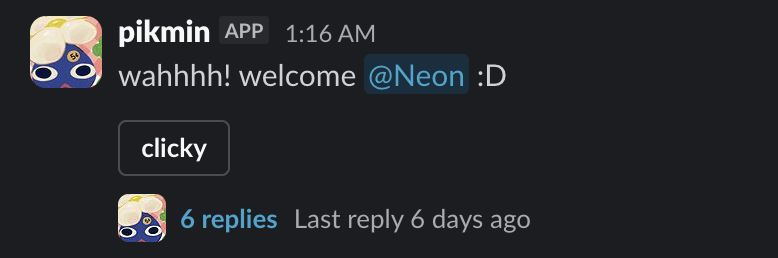
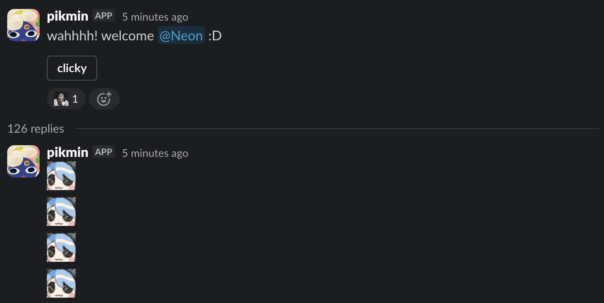
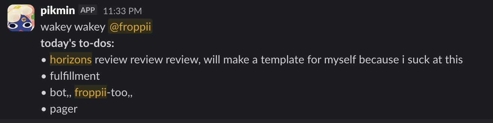
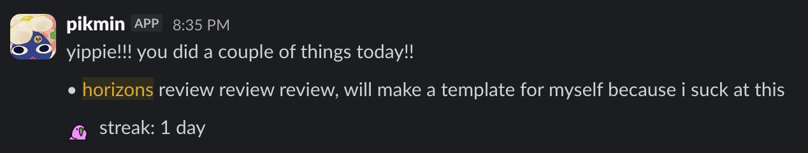

# pikmin
this is a slack bot written with slack bolt that i made to welcome people and keep reminders in my to do list for my personal channel [#froppiis-pikmins](https://hackclub.slack.com/archives/C0819J5AFPS)!

if theres any problems, contact [@froppii](https://hackclub.enterprise.slack.com/team/U07SX29CECA) on slack!

## functionalities
welcoming message when someone new joined the channel

daily to do list message that pulls check lists from the canvas in my channel

daily summarization message for things ive done throughout the day, also based on the _bucket v2_ canvas in my channel

the bot also adds people who joined to the [#pikmins](https://hackclub.slack.com/archives/S08AXRM7BGE) user group!
 
